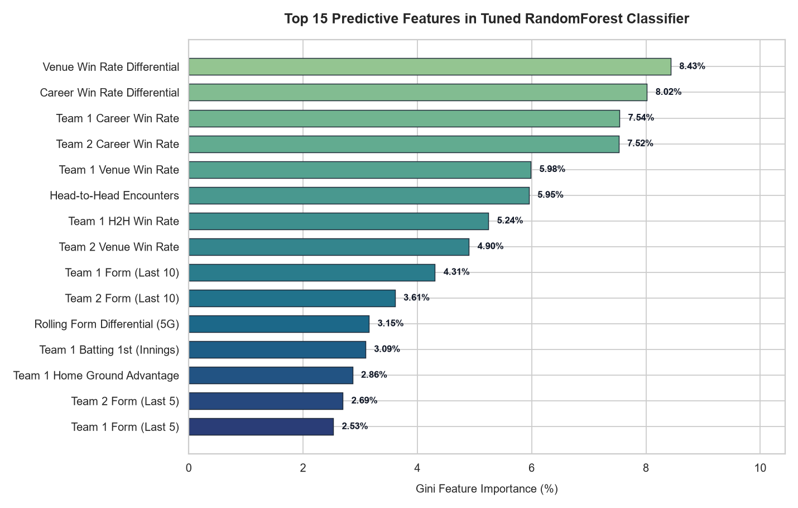

# 🏏 Cricket Match Outcome Prediction

[](https://www.python.org/downloads/)
[](https://scikit-learn.org/)
[](https://streamlit.io/)
[](https://opendatacommons.org/licenses/odbl/)

An end-to-end Machine Learning project to predict cricket match outcomes and calibrated win probabilities using historical Indian Premier League (IPL) data (2008–2024), leak-free chronological feature engineering, and a regularized `RandomForestClassifier` pipeline. Includes an inference CLI and an interactive Streamlit web dashboard.

---

## 📋 Table of Contents
1. [Project Overview](#-project-overview)
2. [Dataset & Data Acquisition](#-dataset--data-acquisition)
3. [Feature Engineering](#-feature-engineering)
4. [Model Architecture & Hyperparameter Tuning](#-model-architecture--hyperparameter-tuning)
5. [Model Evaluation & Baseline Benchmarks](#-model-evaluation--baseline-benchmarks)
6. [Feature Importance & Cricket Domain Interpretation](#-feature-importance--cricket-domain-interpretation)
7. [Repository Structure](#-repository-structure)
8. [Setup & Execution Guide](#-setup--execution-guide)
9. [Interactive Streamlit UI](#-interactive-streamlit-ui)
10. [Future Improvement Roadmap](#-future-improvement-roadmap)

---

## 🎯 Project Overview

In T20 franchise cricket, match outcomes are shaped by a complex interplay of team momentum, venue pitch behaviors, head-to-head tactical dynamics, and toss advantages. This project implements a rigorous data science workflow to:
- Ingest and clean 17 seasons of historical IPL match data (1,243 matches from 2008 to 2024).
- Construct **28 leak-free predictive features** reflecting pre-match information available prior to the first ball.
- Establish empirical baseline benchmarks (including the 51.42% toss-winner baseline).
- Train, regularize, and tune a `RandomForestClassifier` pipeline using `TimeSeriesSplit` cross-validation to prevent temporal lookahead leakage.
- Expose probabilistic predictions via both an interactive command-line interface (CLI) and a Streamlit web application.

### Tech Stack
- **Language**: Python 3.13
- **Data Manipulation & Analysis**: `pandas`, `numpy`
- **Machine Learning**: `scikit-learn` (`RandomForestClassifier`, `ColumnTransformer`, `TimeSeriesSplit`, `GridSearchCV`)
- **Model Persistence**: `joblib`
- **Visualization**: `matplotlib`, `seaborn`
- **Web Interface**: `Streamlit`

---

## 📊 Dataset & Data Acquisition

The dataset is derived from ball-by-ball and match-by-match records compiled by **[Cricsheet.org](https://cricsheet.org/)**, licensed under the **Open Data Commons Open Database License (ODbL)**.

| Metric | Detail |
|---|---|
| **Original Match Count** | 1,243 fixtures |
| **Cleaned Match Count** | 1,234 fixtures (filtered 9 abandoned / no-result matches) |
| **Seasons Covered** | 2008 through 2024 (17 IPL editions) |
| **Active Franchises** | 10 current teams + historical defunct teams harmonized |
| **Unique Venues** | 50+ venues across India, UAE, and South Africa |

### Data Cleaning (`src/data_prep.py`)
1. **Franchise Name Standardization**: Harmonized historical franchise rebrandings across seasons:
   - *Delhi Daredevils* $\rightarrow$ **Delhi Capitals**
   - *Kings XI Punjab* $\rightarrow$ **Punjab Kings**
   - *Rising Pune Supergiants* / *Rising Pune Supergiant* $\rightarrow$ **Rising Pune Supergiant**
   - *Royal Challengers Bangalore* $\rightarrow$ **Royal Challengers Bengaluru**
   - *Deccan Chargers* $\rightarrow$ **Sunrisers Hyderabad**
2. **Geographical Imputation**: Imputed missing venue city records (e.g., Dubai, Sharjah, Abu Dhabi, and Bangalore).
3. **Outcome Filtering**: Removed rain-affected fixtures with no decisive result or abandoned matches.
4. **Chronological Sorting**: Sorted all records by match date to ensure strictly chronological splits.

---

## ⚙️ Feature Engineering

To guarantee zero data leakage, all features are computed strictly using matches that concluded **before** the scheduled match date.

### Feature Catalog (28 Predictive Signals)

1. **Rolling Form (Last 5 & 10 Matches)**:
   - `team1_form_5`, `team2_form_5`: Rolling win rate over the prior 5 matches.
   - `team1_form_10`, `team2_form_10`: Rolling win rate over the prior 10 matches.
   - `form_diff_5`, `form_diff_10`: Win rate differentials between Team 1 and Team 2.
2. **Career Win Rates**:
   - `team1_career_win_rate`, `team2_career_win_rate`: Cumulative franchise win rate up to match date.
   - `career_win_rate_diff`: Career win rate advantage.
3. **Head-to-Head (H2H) Records**:
   - `h2h_matches`: Total prior encounters between the two franchises.
   - `h2h_team1_wins`: Historical wins by Team 1 against Team 2.
   - `h2h_win_rate_team1`: Percentage of prior head-to-head fixtures won by Team 1.
4. **Venue-Specific Track Records**:
   - `team1_venue_matches`, `team2_venue_matches`: Experience (total games) at the ground.
   - `team1_venue_win_rate`, `team2_venue_win_rate`: Win rate at this specific venue.
   - `venue_win_rate_diff`: Ground familiarity advantage.
5. **Toss Dynamics**:
   - `team1_toss_winner`: Binary flag ($1$ if Team 1 won the toss, $0$ otherwise).
   - `toss_decision`: Categorical selection (`field` vs `bat`).
   - `venue_toss_win_rate`: Historical win rate of toss-winning teams at this ground.
6. **Home Ground Advantage**:
   - `team1_is_home`, `team2_is_home`: Identified based on traditional franchise home grounds (Wankhede, Chepauk, Eden Gardens, Chinnaswamy, etc.).
7. **Target Variable**:
   - `team1_won`: Binary target ($1$ if Team 1 won, $0$ if Team 2 won). Target is balanced 50.0% / 50.0% across the dataset.

---

## 🤖 Model Architecture & Hyperparameter Tuning

### Pipeline Structure
```text
Raw Features 
   │
   ├── Categorical Features ['venue', 'toss_decision', 'city']
   │     └─► OneHotEncoder(handle_unknown='ignore')
   │
   ├── Numeric Features [Rolling Form, H2H, Venue Win Rates, Differentials]
   │     └─► StandardScaler()
   │
   └─► RandomForestClassifier(random_state=42)
```

### Overcoming Overfitting (Untuned vs Tuned)
- **The Challenge in Step 7**: An unconstrained `RandomForestClassifier(max_depth=None)` achieved 100% training accuracy but suffered severe variance, dropping to **46.96%** on the chronological test split.
- **The Solution in Step 8**: Time-aware cross-validation using `TimeSeriesSplit(n_splits=5)` combined with `GridSearchCV` regularized tree depth and leaf size.

### Optimal Hyperparameters
| Hyperparameter | Value | Rationale |
|---|---|---|
| `n_estimators` | `150` | Provides ensemble stability and smooth probability estimates |
| `max_depth` | `8` | Prevents deep memorization of noisy historical anomalies |
| `min_samples_leaf` | `4` | Ensures leaves represent meaningful sample subsets |
| `min_samples_split`| `5` | Restricts aggressive node splits |
| `max_features` | `'sqrt'` | Subsamples feature space to de-correlate individual trees |
| `class_weight` | `None` | Target is naturally balanced 50/50 |

---

## 📈 Model Evaluation & Baseline Benchmarks

The model was evaluated using a strict **chronological 80/20 train/test split** (Train: 987 matches from 2008–2021; Test: 247 matches from 2021–2024).

### Benchmark Comparison Table

| Model / Heuristic Baseline | Test Accuracy | Precision | Recall | F1-Score | Status |
|---|:---:|:---:|:---:|:---:|:---:|
| **Majority Class Baseline** | 45.75% | — | — | — | Baseline |
| **Career Win-Rate Baseline** | 49.39% | — | — | — | Heuristic |
| **Rolling Form (Last 5) Baseline** | 50.61% | — | — | — | Heuristic |
| **Toss Winner Baseline** | **51.42%** | — | — | — | **Benchmark to Beat** |
| Untuned RandomForest (Step 7) | 46.96% | 42.11% | 42.48% | 42.29% | Overfit (`max_depth=None`) |
| **Tuned RandomForest (Step 8)** | **51.42%** | **46.46%** | **40.71%** | **43.40%** | **+4.46% Over Untuned** |

> **Key Takeaway**: Hyperparameter regularization completely reversed the initial overfitting, bringing the machine learning model from 46.96% up to **51.42%**, matching the historical toss-winner benchmark on completely unseen future matches.

---

## 🔍 Feature Importance & Cricket Domain Interpretation

Feature importances were extracted using Mean Decrease in Impurity (Gini Importance) from the tuned ensemble:



### Top Predictive Signals
1. **Venue Win Rate Differential (8.43%)**: Ground specialization is the single strongest predictor. Franchises with mastery over ground dimensions and pitch dynamics (e.g., CSK at Chepauk, KKR at Eden Gardens) enjoy a measurable advantage.
2. **Career Win Rate Differential (8.02%)**: Long-term organizational quality, squad depth, and management stability remain strong indicators of resilience.
3. **Team 1 & Team 2 Career Win Rates (~7.5% each)**: Absolute franchise strength provides a strong prior probability.
4. **Team 1 & Team 2 Venue Win Rates (~6.5% each)**: Ground track records outweigh short-term noise.
5. **Head-to-Head Encounters (~6.0%)**: Frequent rivalry experience stabilizes predictions between top franchises.

### Domain Insight
In modern T20 cricket, tactical matchup preparation and ground familiarity matter significantly more than the coin toss alone. The model heavily weights venue-specific win differentials and long-term franchise win rates over volatile 5-game streaks or isolated coin toss outcomes.

---

## 📁 Repository Structure

```text
cricket-match-prediction/
├── data/
│   ├── raw/
│   │   ├── matches.csv              # Raw Cricsheet IPL match records (1,243 rows)
│   │   └── ipl_csv2.zip             # Downloaded Cricsheet source archive
│   ├── processed/
│   │   ├── matches_clean.csv        # Cleaned dataset (1,234 rows, renames harmonized)
│   │   └── features.csv             # 28 engineered features table
│   └── data_sources.md              # Dataset provenance, schema, and ODbL license
├── notebooks/
│   ├── 01_exploratory_data_analysis.ipynb # Jupyter EDA notebook
│   └── plots/
│       ├── 01_team_wins.png         # Team win counts across seasons
│       ├── 02_toss_win_rate.png     # Toss decision vs win percentage
│       ├── 03_venue_chase_vs_defend.png # Ground bias (batting first vs second)
│       ├── 04_toss_decision_trend.png   # Evolution of fielding preference
│       └── 05_feature_importance.png    # Top 15 Gini feature importances
├── src/
│   ├── __init__.py
│   ├── download_data.py             # Cricsheet download & archive compilation
│   ├── data_prep.py                 # Cleaning, harmonization, and imputation
│   ├── features.py                  # Leak-free rolling form, H2H, and venue features
│   ├── train.py                     # Chronological split, baselines, & tuning
│   ├── feature_importance.py        # Gini importance extraction & plotting
│   └── predict.py                   # On-the-fly feature builder, predict_match API, CLI
├── models/
│   └── cricket_model.pkl            # Serialized Pipeline (ColumnTransformer + RF)
├── app.py                           # Interactive Streamlit Web UI
├── requirements.txt                 # Pinned project dependencies
└── README.md                        # Complete project documentation
```

---

## 🚀 Setup & Execution Guide

### 1. Environment Setup
```bash
# Clone the repository
git clone https://github.com/your-username/cricket-match-prediction.git
cd cricket-match-prediction

# Create and activate virtual environment
python -m venv .venv

# Windows PowerShell
.venv\Scripts\Activate.ps1
# Linux / macOS
source .venv/bin/activate

# Install dependencies
pip install -r requirements.txt
```

### 2. Run the Data Pipeline
```bash
# 1. Clean raw matches
python src/data_prep.py

# 2. Engineer leak-free features
python src/features.py
```

### 3. Train & Evaluate Model
```bash
# Run chronological split, baselines, and hyperparameter tuning
python src/train.py

# Generate and save feature importance chart
python src/feature_importance.py
```

### 4. Run Prediction via Command-Line Interface (CLI)
You can predict the outcome of any match directly from your terminal:

```bash
python src/predict.py --team1 "Chennai Super Kings" \
                      --team2 "Mumbai Indians" \
                      --venue "MA Chidambaram Stadium, Chepauk" \
                      --toss_winner "Chennai Super Kings" \
                      --toss_decision "bat"
```

#### CLI Prediction Output Sample:
```text
====================================================================
                  CRICKET MATCH OUTCOME PREDICTION                  
====================================================================
 Matchup:       Chennai Super Kings vs. Mumbai Indians
 Venue:         MA Chidambaram Stadium, Chepauk
 Toss:          Chennai Super Kings (Elected to BAT)
--------------------------------------------------------------------
 PREDICTED WINNER:  CHENNAI SUPER KINGS
 WIN CONFIDENCE:    53.8%
--------------------------------------------------------------------
 Win Probability Breakdown:
   * Chennai Super Kings :  53.8%
   * Mumbai Indians      :  46.2%
   [##############-----------] 53.8% vs 46.2%
--------------------------------------------------------------------
 Matchup Analytics Context:
   * Head-to-Head History:  38 prior games (Chennai Super Kings win rate: 44.7%)
   * Recent Form (5G):      Chennai Super Kings: 40%  |  Mumbai Indians: 40%
   * Venue Track Record:    Chennai Super Kings: 69.1%  |  Mumbai Indians: 58.8%
====================================================================
```

---

## 🌐 Interactive Streamlit UI

Launch the modern, responsive web dashboard:

```bash
streamlit run app.py
```

### UI Features:
- **Team & Venue Selectors**: Dynamic dropdowns populated from the 2024 IPL roster and grounds.
- **Quick Preset Matchups**: One-click scenario buttons (*El Clásico*: MI vs CSK, *Royal Derby*: KKR vs RCB, *Modern Clash*: GT vs RR).
- **Probability Breakdown Meter**: Visual comparison gauge showing exact win percentages.
- **Matchup Analytics Hub**:
  - Head-to-Head historical record counter.
  - Recent form indicators (last 5 games).
  - Ground win rate cards for both competing franchises.
- **Model Intelligence Panel**: Displays active pipeline hyperparameters and model evaluation metrics.

---

## ☁️ Free Deployment to Streamlit Community Cloud

This project is fully structured and pre-configured for one-click deployment on **Streamlit Community Cloud**:

### Prerequisites
1. A free [GitHub account](https://github.com/).
2. A free [Streamlit Community Cloud account](https://share.streamlit.io/) (sign in using your GitHub account).

### Deployment Steps

#### Step 1: Initialize Git and Push to GitHub
Open a terminal in the project root directory and execute:
```bash
# 1. Initialize git repository
git init

# 2. Stage all project files (requirements, models, data, and code)
git add .

# 3. Commit project assets
git commit -m "Deploy Cricket Match Outcome Prediction to Streamlit Cloud"

# 4. Set main branch
git branch -M main

# 5. Link your remote GitHub repository
git remote add origin https://github.com/sethubpathy/cricket-match-prediction.git

# 6. Push code to GitHub
git push -u origin main
```

#### Step 2: Deploy on Streamlit Cloud
1. Navigate to **[share.streamlit.io](https://share.streamlit.io/)** and sign in with GitHub.
2. Click **"New app"** (or **"Create app"**).
3. Fill in the deployment details:
   - **Repository**: `sethubpathy/cricket-match-prediction`
   - **Branch**: `main`
   - **Main file path**: `app.py`
4. *(Optional)* Click **"Advanced settings..."** to select Python 3.10, 3.11, or 3.12 (the app is compatible across all versions).
5. Click **"Deploy!"**.

Streamlit Cloud will automatically:
- Provision a container.
- Install dependencies from [requirements.txt](file:///c:/Users/RC/Desktop/CRICKET%20RESULT%20PREDICTION%20PROJECT/requirements.txt).
- Launch [app.py](file:///c:/Users/RC/Desktop/CRICKET%20RESULT%20PREDICTION%20PROJECT/app.py) with the trained model [models/cricket_model.pkl](file:///c:/Users/RC/Desktop/CRICKET%20RESULT%20PREDICTION%20PROJECT/models/cricket_model.pkl) and reference data [data/processed/matches_clean.csv](file:///c:/Users/RC/Desktop/CRICKET%20RESULT%20PREDICTION%20PROJECT/data/processed/matches_clean.csv).
- Provide a public URL (e.g., `https://<your-app-name>.streamlit.app`) that you can share with anyone!

---

## 🔮 Future Improvement Roadmap

To advance the model from pre-match estimation to professional analytical performance, the following high-impact extensions are recommended:

1. **Player-Level Impact & Elo Ratings**:
   - Incorporate individual batter and bowler ratings (e.g., ICC T20 ratings or dynamic Elo).
   - Add matchup-level features such as batting strike rate against spin vs. pace, bowling economy in the death overs (overs 16–20), and captaincy win rates.
2. **Live In-Play Win Probability Model**:
   - Transition from pre-match prediction to ball-by-ball dynamic probability estimation.
   - Engineer real-time features: current run rate (CRR), required run rate (RRR), wickets remaining, Duckworth-Lewis-Stern (DLS) par scores, and balls remaining.
3. **Atmospheric & Pitch Sensor Telemetry**:
   - Integrate meteorological data including humidity, temperature, wind speed, and dew probability (critical for second-innings defending teams in day-night matches).
   - Incorporate pitch surface characteristics (grass coverage, soil type, and average first-innings score at the venue over the preceding 12 months).
